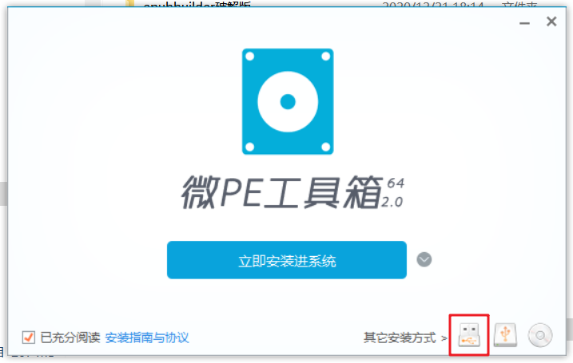

windows安装过程中遇到的各种问题及解决，包括windows server 2008 r2、windows 7、windows10的安装和server系统的网卡的安装。系统安装方式主要包括U盘安装、PE盘安装、GHOST安装。其中，GHOST安装也需要准备PE盘。

# 三种常见安装方式

## U盘安装

1. 准备一个空白U盘和系统镜像
2. 将U盘格式化为FAT32格式
3. 打开系统镜像，将镜像中的文件拷贝到U盘中
    1. 由于FAT32系统不支持大于4G的单个文件复制，如果sources\install.wim文件大于4G，则需要使用以下命令进行复制（其中，H为U盘盘符，J为镜像装载盘符）：
        ```
        Dism /Split-Image /ImageFile:J:\sources\install.wim /SWMFile:H:\sources\install.swm /FileSize:4000
        ```
4. 将U盘插入机器，启动机器
5. 进入机器BIOS，选择从U盘引导
6. 按照系统指引进行安装。

PS:也可以使用U盘启动盘制作工具来制作，例如：UltraISO[UltraISO](https://cn.ultraiso.net/)

## PE盘安装

1. 准备一个空白U盘、系统镜像和PE工具。（PE系统是微软提供的一个微型系统，整个系统运行在内存中。PE工具是第三方开发的用于制作PE镜像、PE盘等）
2. 使用PE工具制作PE盘

3. 将系统镜像拷贝到PE盘中
4. 将U盘插到机器上，启动机器
4. 进入机器BIOS，选择从U盘引导
5. 重启机器进入PE系统
6. 安装
    1. 可以直接使用镜像中的setup.exe进行安装——装载iso镜像->双击setup.exe，根据指引进行安装。
    2. 可以使用windows安装器安装（参考教程：）
    3. 可以手动安装——将机器的磁盘格式化->将镜像中的文件拷贝到主系统磁盘->重启机器，进入BIOS选择从硬盘引导->根据指引进行安装

## GHOST安装

视频教程：[【系统】GHO系统的安装](https://www.bilibili.com/video/BV1F64y197H6)

1. 准备一个空白U盘、GHOST文件和PE工具。
2. 制作PE盘
3. 将GHOST文件拷贝到PE盘
4. 将U盘插到机器上，启动机器
4. 进入机器BIOS，选择从U盘引导
5. 重启机器进入PE系统
6. 打开GHOST工具，选择机器的主系统分区，使用GHOST文件恢复分区

注意事项：如果生成GHOST文件的机器主分区容量大于本机器主分区，会恢复失败；小于则没有关系。
PPS.GHOST文件可以自己生成，视频教程：[【使用VMare虚拟机和PE工具自制纯净的GHOST文件】](https://www.bilibili.com/video/BV1Mf4y1a7Nq/)

# windows server 2008 r2 桌面主板的网卡驱动安装

视频教程：[【系统】server系统安装I211-AT网卡驱动](https://www.bilibili.com/video/BV1By4y137ns/)

在近几年新出的主板上安装windows server 2008 r2和安装windows 7一样都会遇到驱动的问题，原因就是主板和系统都没有提供USB驱动，需要手动安装。

由于Windows系统原因，一般桌面主板自带的Intel网卡（典型的包括I211、I211-AT、I217-V、I218-V、I219-V）等，都无法在Windows Server系统上找到对应的驱动。但是，这些网卡几乎都有对应的服务器主板版本（例如I219-LM）。这些网卡其实并没有本质上的差别，只是在驱动层面，利用不同的驱动签名使得网卡不能通用。(摘自：[Windows Server 2019安装Intel I219-V I211网卡驱动](https://blog.csdn.net/bobytomm/article/details/103582264))

## 1.系统安装

参照【三种常见安装方式】选择一种方式将windows server 2008 r2安装到机器。
需要注意的是，windows server 2008 r2与windows7一样没有驱动，要么使用PE盘的windows安装器装好系统后使用驱动总裁离线版进行驱动预装，要么先使用PS2键鼠安装好系统再在PE系统中使用驱动总裁离线版进行驱动安装。（反正都是要在PE中用驱动总裁装驱动）

## 2.准备文件

1. 驱动总裁win7离线版： https://www.sysceo.com/Software-softwarei-id-262.html
2. 下载网卡对应的驱动：支持Intel i211-AT+windows server 2008 r2的网卡驱动https://downloadcenter.intel.com/download/29572/Intel-Ethernet-Adapter-Complete-Driver-Pack

## 3.准备工具

PS2接口的键盘：因为server版的系统需要输入密码才能进入系统，进入系统后才能安装USB驱动，所以密码只能通过PS2接口的键盘来输入。

## 4.安装系统

1. 把PE盘插入机器，开机进入Bios，选择从PE盘引导
2. 进入PE系统后，双击打开DG工具，初始化机器硬盘分区
3. 双击打开Ghost备份还原工具，选择机器硬盘所在分区，选择准备好的GHO文件，选择恢复分区
4. 双击打开驱动总裁文件，双击exe程序，选择系统盘符(就是我们恢复的那个分区所用盘符)，选择“加载驱动到目标系统”
5. 将键盘接到机器上
6. 重启机器

## 5.安装网卡驱动

1. 修改网卡驱动安装信息
    1. 进入“PRO1000”》“Win64”(跟机器位数相关)》“NDIS62”(跟server版本有关，2012选择NDIS64)，用记事本打开文件“elr52*64”
    2. 搜索i211
    
    3. 搜索到i211所在选项卡，复制下面的E1539.6.1.1
    
    4. 回到文件顶部，搜索E1539.6.1.1。复制搜索到的第一行，这一行就是安装信息。
    
    5. 将这一行粘贴到下面64.6.1的选项卡中，保存文件。
    
2. 修改系统模式
    管理员权限执行如下命令来关闭签名校验，开启测试模式，否则会安装失败。
    ```
    bcdedit -set loadoptions DISABLE_INTEGRITY_CHECKS
    bcdedit -set TESTSIGNING ON
    ```
    重启机器，进入测试模式。
    PS:安装完成后可用以下命令恢复：
    ```
    bcdedit -set loadoptions ENABLE_INTEGRITY_CHECKS
    bcdedit -set TESTSIGNING OFF
    ```
3. 从磁盘安装驱动
    
    
    
    
    
    
    
    
    
    
    

# windows 7 驱动安装

windows7原版镜像基本上没有驱动，因此需要手动安装驱动。驱动总裁可以在已经装好的系统盘中预装系统，然后在系统启动后自动安装驱动，比较方便。

如果有PS2键鼠，则可以先安装系统再使用PE盘和驱动总裁装驱动；如果没有PS2键鼠，则需要使用PE盘中的windows安装器或GHOST工具安装系统，然后使用驱动总裁预装驱动。

大致步骤如下：

1. 准备好驱动总裁win7离线版镜像、PE盘，将驱动总裁win7离线版镜像拷贝到PE盘
2. 参照【三种常见安装方式】选择一种安装方式将windows 7安装到机器。
3. 将PE盘插入机器，启动机器，进入BIOS，选择从U盘引导
4. 进入PE系统，双击打开驱动总裁win7离线版镜像，双击运行DrvCeo程序，加载驱动到目标系统。
5. 重启机器，选择从硬盘引导。机器启动后，等待驱动安装。

# windows10 MBR方式安装

1. 参照【三种常见安装方式-U盘安装】制作win10安装盘
2. 在BIOS将主板启动方式改为EFI/Legacy（EFI对应UEFI，Legacy对应MBR）
3. 将U盘插入机器，启动机器，进入机器BIOS，选择从U盘引导
4. 进入操作系统安装界面，使用shift+F10打开命令提示符，输入diskpart进入硬盘管理
    ```
    list disk
    select disk 0
    clean
    create partition primary size=100000
    format quick fs=ntfs
    assign letter="W"
    active
    exit
    ```
    其中，select disk 0中的0是要安装系统的磁盘的序号，由list disk查询得到；size的单位是MB；"W"是为系统盘分配的盘符。
5. 将U盘文件复制到磁盘中```xcopy /s U:\* W:\```。其中U为U盘盘符，需要使用可能的盘符和dir试试看哪个是U盘。
6. 执行MBR引导代码安装命令```W:\boot\bootsect.exe /nt60 W:```
7. 重启机器，在BIOS中选择Legacy或EFI/Legacy启动方式，选择从无UEFI标记的硬盘引导。